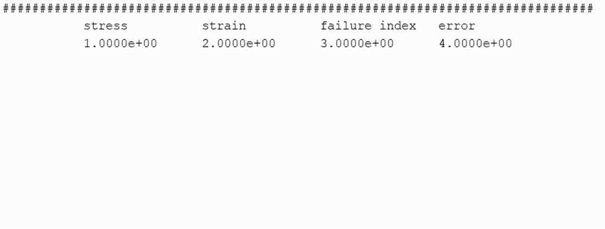
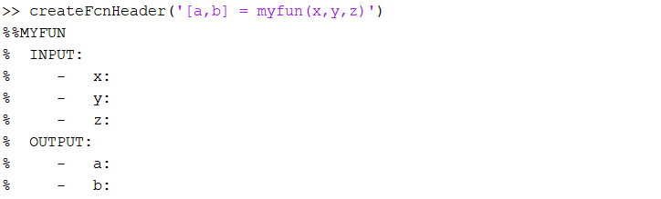

# MATLAB-Add-Ons
Custom Matlab Add-Ons for nice things.

## TerminalList
This is just a small snippet that creates a list in the terminal from given data. Usefull for iteration routines to see the progress. The GIF below is just an example.

## GenerateTerminalMsg
Generates a terminal message sourrounded by a box. Sometimes useful for long running code to give an update when starting a new section, for instance.

## CreateFcnHeader
Simply creates a function header. Useful if you want your function header being consistent through all of your created functions.

## NewtonCotes/NewtonCotes2D
Just an integration method using weighted function evaluations
